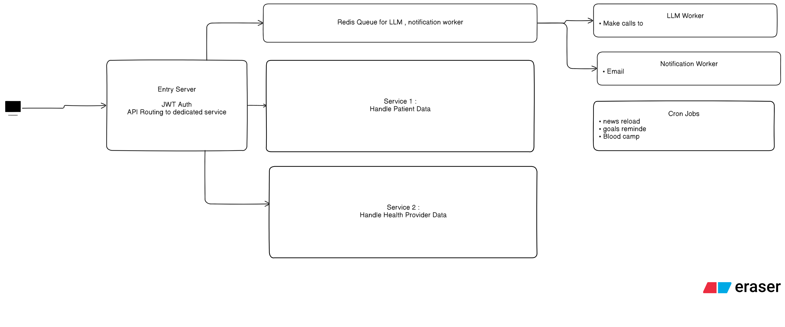
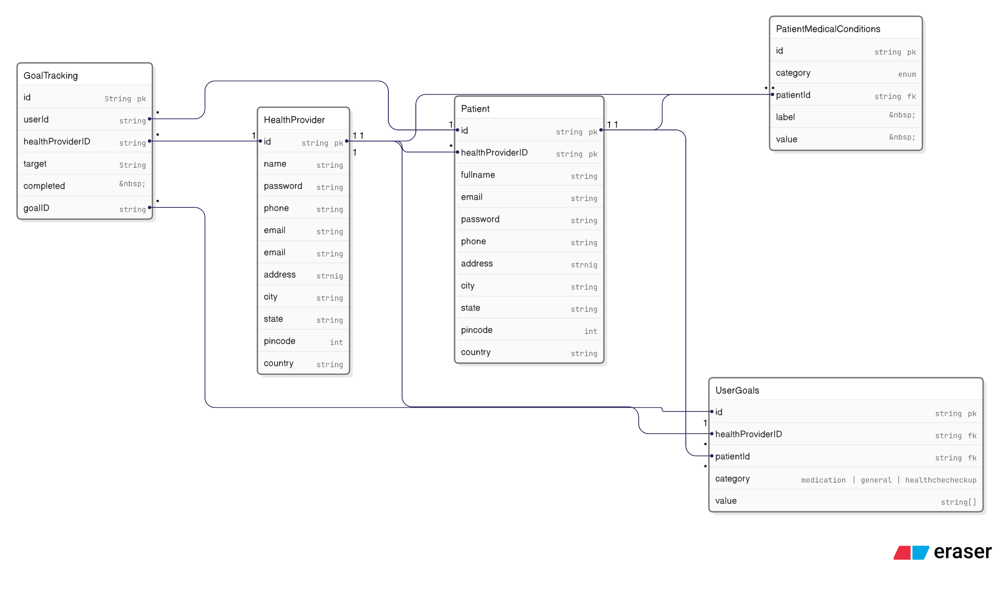

# 🏥 MediTech Platform

A medication management platform connecting doctors with patients through medication tracking, goal monitoring, and AI-powered voice reminders.

## 📋 Overview

**Two Portals:**
- **Doctor/Assistant Portal** - Manage patients, medications, goals, and diet plans
- **Patient Portal** - Track medications, goals, diet, view health blogs, and receive AI call reminders

## High  Level


## Database Design



## ✨ Features

### Doctor/Assistant Portal
- Add patient details
- Assign medications with schedules
- Set daily health goals
- Create diet plans
- Send invitation links to patients

### Patient Portal
- View medication schedule
- Track and update goal status
- Access personalized diet plan
- Read health blogs and news
- Receive AI voice call reminders for medication

### AI Voice Agent
- Automated phone calls for medication reminders
- Ask patients about medication adherence
- Track compliance
- Remind patients about missed doses

## 🛠️ Tech Stack (MERN)

- **Frontend**: React.js
- **Backend**: Node.js + Express.js
- **Database**: MongoDB
- **Authentication**: JWT
- **AI Voice**: Twilio Voice API

## 🚀 Installation

### Prerequisites
- Node.js (v14+)
- MongoDB
- npm or yarn

### Setup

1. **Clone the repository**
   ```bash
   git clone https://github.com/yourusername/medicare-platform.git
   cd MediTech-platform
   ```

2. **Backend Setup**
   ```bash
   cd backend
   npm install
   ```

   Create `.env` file:
   ```env
   MONGODB_URI=mongodb://localhost:27017/medicare
   JWT_SECRET=your_secret_key
   PORT=5000
   TWILIO_ACCOUNT_SID=your_twilio_sid
   TWILIO_AUTH_TOKEN=your_twilio_token
   TWILIO_PHONE_NUMBER=your_phone_number
   ```

3. **Frontend Setup**
   ```bash
   cd frontend
   npm install
   ```

   Create `.env` file:
   ```env
   REACT_APP_API_URL=http://localhost:5000
   ```

4. **Run the Application**
   ```bash
   # Terminal 1 - Backend
   cd backend
   npm start

   # Terminal 2 - Frontend
   cd frontend
   npm start
   ```

5. **Access**
   - Frontend: http://localhost:3000
   - Backend: http://localhost:5000

## 📁 Project Structure

```
medicare-platform/
├── backend/
│   ├── models/          # MongoDB models
│   ├── routes/          # API routes
│   ├── controllers/     # Route controllers
│   ├── middleware/      # Auth & validation
│   ├── config/          # Database config
│   └── server.js        # Entry point
│
├── frontend/
│   ├── public/
│   └── src/
│       ├── components/  # React components
│       ├── pages/       # Page components
│       ├── services/    # API calls
│       ├── context/     # Context API
│       └── App.js       # Main app
```


## 📱 Usage

### For Doctors/Assistants:
1. Login to doctor portal
2. Add patient details
3. Add medications with schedule
4. Set daily goals
5. Create diet plan
6. Send invitation to patient

### For Patients:
1. Click invitation link
2. Complete registration
3. View medications and goals
4. Mark goals as completed
5. Receive AI reminder calls
6. Read health blogs
